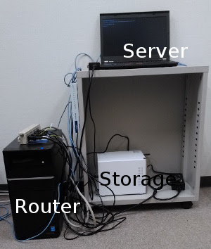

Phonon database at Kyoto university
====================================

About this web site
--------------------

It's getting to be a mainstream idea collecting a big set of ab-initio
calculations and analyzing them by informatics approach. For
scientific purpose, we plan to do it for phonon properties. As an
attempt, we have run a set of ab-initio phonon calculations and left
the raw data on this static web site. The aim of this web site is just
leaving the data to distribute. We have no plan to prepare any fancy
web interface and can't expect very stable operation of this web site
since our human resource is limited.

This picture is all the system of this web site.

Available data associated with Materials Project IDs
-----------------------------------------------------

.. toctree::
   :maxdepth: 1

   database-mp

License
--------

The contents of this web site are licensed under a `Creative Commons Attribution 4.0
International License <http://creativecommons.org/licenses/by/4.0/>`_
unless another license is specially mentioned in each web page.

.. image :: https://i.creativecommons.org/l/by/4.0/88x31.png
   :target: http://creativecommons.org/licenses/by/4.0/
   :alt: license

Contact
--------

* `Atsushi Togo <http://atztogo.github.io/>`_ : atz.togo@gmail.com
   
